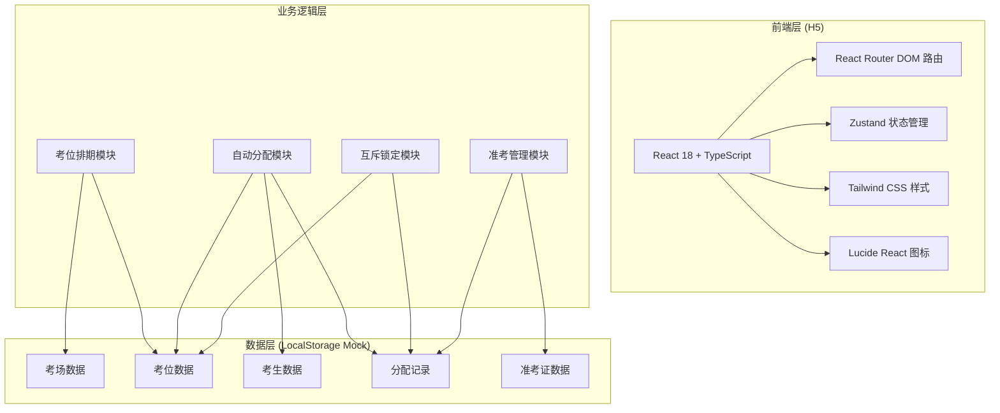
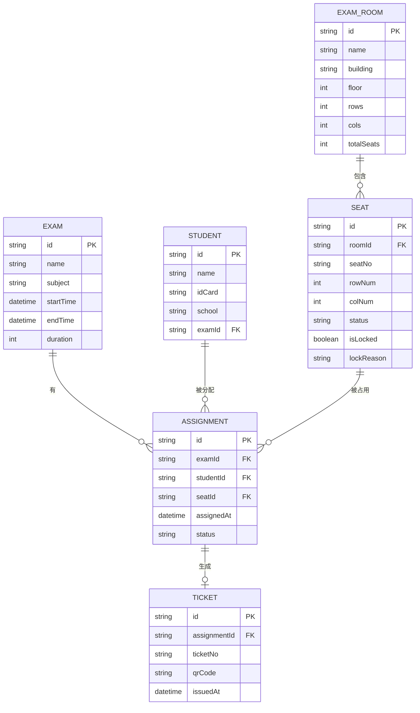

## 1. 架构设计



## 2. 技术描述

- **前端**：React@18 + TypeScript@5 + Vite@5
- **UI框架**：Tailwind CSS@3
- **状态管理**：Zustand@4
- **路由**：React Router DOM@6
- **图标库**：lucide-react@0.344
- **初始化工具**：vite-init
- **后端**：无后端，使用 LocalStorage + Mock 数据实现本地持久化
- **数据存储**：浏览器 LocalStorage

## 3. 路由定义

| 路由 | 页面/功能 | 模块 |
|-------|---------|------|
| /dashboard | 首页数据概览 | Dashboard |
| /scheduling/exam-rooms | 考场管理 | 考位排期 |
| /scheduling/seats | 考位建档 | 考位排期 |
| /scheduling/exams | 考试场次 | 考位排期 |
| /assignment/students | 考生管理 | 自动分配 |
| /assignment/auto | 智能编排 | 自动分配 |
| /locking/matrix | 锁定矩阵 | 互斥锁定 |
| /locking/conflicts | 冲突拦截 | 互斥锁定 |
| /ticket/generate | 准考证生成 | 准考管理 |
| /ticket/list | 准考证列表 | 准考管理 |

## 4. 数据模型

### 4.1 数据模型定义



### 4.2 核心数据类型

```typescript
// 考场
interface ExamRoom {
  id: string;
  name: string;
  building: string;
  floor: number;
  rows: number;
  cols: number;
  totalSeats: number;
}

// 考位
interface Seat {
  id: string;
  roomId: string;
  seatNo: string;
  rowNum: number;
  colNum: number;
  status: 'available' | 'occupied' | 'disabled';
  isLocked: boolean;
  lockReason?: string;
  lockedBy?: string;
  lockedAt?: Date;
}

// 考试场次
interface Exam {
  id: string;
  name: string;
  subject: string;
  startTime: Date;
  endTime: Date;
  duration: number;
}

// 考生
interface Student {
  id: string;
  name: string;
  idCard: string;
  school: string;
  examId: string;
}

// 分配记录
interface Assignment {
  id: string;
  examId: string;
  studentId: string;
  seatId: string;
  assignedAt: Date;
  status: 'pending' | 'confirmed' | 'cancelled';
}

// 准考证
interface Ticket {
  id: string;
  assignmentId: string;
  ticketNo: string;
  qrCode: string;
  issuedAt: Date;
}

// 分配算法配置
interface AllocationConfig {
  avoidFragmentation: boolean;
  loadBalance: boolean;
  avoidSameSchool: boolean;
  preferContiguous: boolean;
}
```

## 5. 核心算法

### 5.1 智能择优分配算法

1. **碎片避免策略**：优先选择连续空闲区域，计算考位的"连续度评分"，选择连续度最高的区域
2. **负载均衡策略**：统计各考场已占用率，优先分配给占用率较低的考场
3. **同校避开策略**：检测相邻考位考生学校信息，确保同校考生不相邻
4. **重复撮合拦截**：分配前检查考位锁定状态与考生分配记录，防止重复分配

### 5.2 互斥锁定机制

- 分配成功后立即设置 `isLocked = true`，记录锁定时间与操作人
- 再次分配该考位时触发拦截机制，返回冲突错误
- 锁定状态支持手动解锁（需权限验证）
- 分配取消时自动释放锁定
