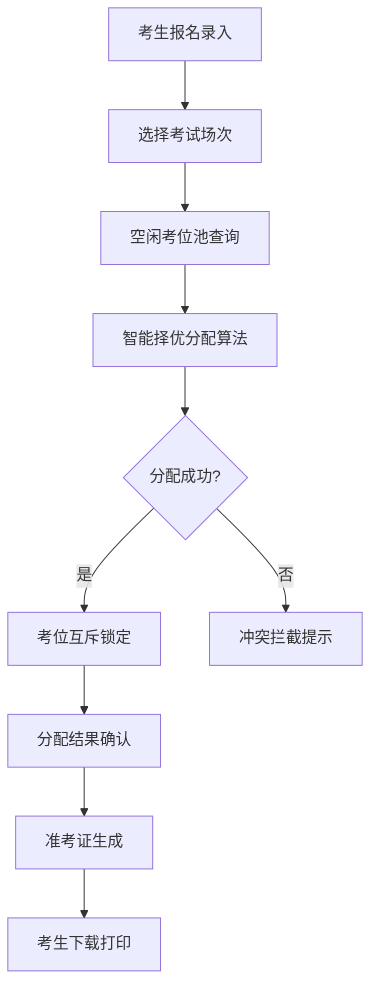

## 1. 产品概述

考试院考场座位编排H5系统，用于自动化考试座位分配与管理。解决传统人工编排效率低、易出错、碎片考位难利用等问题，实现考位资源智能分配、互斥锁定、准考证一键生成。

- **目标用户**：考试院考务人员、学校管理员
- **核心价值**：智能择优分配、避免碎片考位、负载均衡占用、同校考生规避、互斥锁定防冲突

## 2. 核心功能

### 2.1 用户角色

| 角色 | 核心权限 |
|------|----------|
| 考务管理员 | 考位资源建档、编排策略配置、座位分配、锁定管理、准考证管理 |

### 2.2 功能模块

1. **考位排期模块**：考场资源建档、考位管理、考试场次排期
2. **自动分配模块**：空闲考位择优分配、负载均衡、同校避开编排
3. **互斥锁定模块**：成交互斥锁定、重复撮合拦截、锁定状态管理
4. **准考管理模块**：准考证生成、准考证查询、准考证打印

### 2.3 页面详情

| 页面名称 | 模块名称 | 功能描述 |
|-----------|-------------|---------------------|
| 首页Dashboard | 数据概览 | 统计卡片、考位使用率、近期考试、分配进度 |
| 考位排期 | 考场管理 | 考场列表、新增/编辑/删除考场、考场座位图配置 |
| 考位排期 | 考位建档 | 考位列表、考位状态、考位批量导入 |
| 考位排期 | 考试排期 | 考试场次列表、场次创建、时间配置 |
| 自动分配 | 考生报名 | 考生信息列表、批量导入考生、同校标记 |
| 自动分配 | 智能编排 | 一键分配、分配算法选择、分配结果预览、碎片考位统计 |
| 互斥锁定 | 锁定状态 | 考位锁定矩阵、锁定/解锁操作、锁定原因记录 |
| 互斥锁定 | 冲突拦截 | 重复分配拦截日志、冲突告警、冲突人工处理 |
| 准考管理 | 准考证 | 准考证模板、准考证批量生成、准考证下载/打印 |

## 3. 核心流程

考生报名后，系统根据考试时间从空闲考位中执行智能择优分配：优先选择连续区域考位避免碎片，进行负载均衡使各考场占用率均匀，同校考生自动错开编排。分配成功后考位立即互斥锁定，防止重复分配。最后批量生成准考证。

## 4. 用户界面设计

### 4.1 设计风格

- **主色调**：深蓝 #1e3a8a（专业、权威），辅色：青色 #0891b2，强调色：琥珀 #d97706
- **按钮风格**：圆角8px、微立体阴影、悬停上浮效果
- **字体**：Noto Sans SC - 现代中文无衬线字体，清晰易读
- **布局风格**：顶部导航 + 侧边模块菜单 + 主内容区的三段式布局
- **图标风格**：lucide-react 线性图标，简洁专业

### 4.2 页面设计概览

| 页面名称 | 模块名称 | UI元素 |
|-----------|-------------|-------------|
| Dashboard | 数据概览 | 渐变统计卡片、环形进度图、列表表格、时间轴 |
| 考位排期 | 考场管理 | 卡片式考场列表、座位网格图、模态框表单 |
| 自动分配 | 智能编排 | 步骤引导条、算法配置面板、座位热力图、分配结果对比 |
| 互斥锁定 | 锁定矩阵 | 颜色编码网格、批量操作栏、状态图例 |
| 准考管理 | 准考证 | 证书样式预览、批量操作工具栏、下载进度条 |

### 4.3 响应性

采用移动优先H5设计，自适应360px~1440px屏幕宽度。触屏优化：大按钮、足够的点击热区、滑动手势支持。
